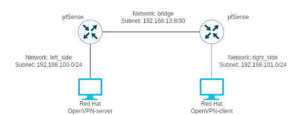
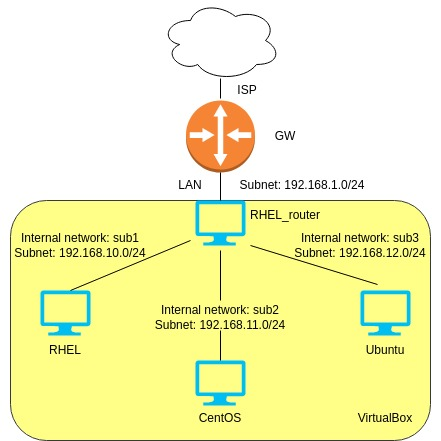

Hi all,

My name's Wojtek and I own business called 'WOJST Usługi Informatyczne Wojciech Stańczyk' with a website https://wojst.pl 
I write my thoughts, tips and another IT notes on the blog, which can be found at https://wojst.pl/blog

Today (29-04-2023) I've started the #100DaysOfLinux challenge. My goal is to finish all courses I have purchased but haven't yet completed and complete many labs during this time.

I aspire to be a Linux Administrator, which is my main goal, and I'm also considering the possibility of working in DevOps or SysOps.

Additionaly, I'm a firefighter in Państwowa Straż Pożarna, where we work 24-hour shifts every three days. During my shifts I will try found a few minutes to read or watch something related to this challenge.

So, let's get started :)

-- 
var ASL = course 'Administracja Serwerami Linux' by Grupa ADM 

---

### :yellow_circle: Day 1 (Saturday, 29-04-2023)
**Git**
- work with git (create remote repo and push commits) 
https://wojst.pl/github-repozytoria-zdalne-i-pull-requesty-git/  
**ebook '77 zadań dla adminów' by Jakub ‘unknow’ Mrugalski - user management**
- exercises about users management in Linux (performed on Ubuntu running in Docker)  

### :yellow_circle: Day 2 (Sunday, 30-04-2023) [Firefighter duty]
**Docker**
- watch a film on YT from IT conference - "how Docker work inside"

### :yellow_circle: Day 3 (Monday, 01-05-2023)
**ebook '77 zadań dla adminów' by Jakub ‘unknow’ Mrugalski - file management**
- exercises about file management in Linux (performed on Ubuntu running in Docker)

### :yellow_circle: Day 4 (Thuesday, 02-05-2023)
**ebook '77 zadań dla adminów' by Jakub ‘unknow’ Mrugalski - Apache**
- configure the web server (Apache), which is running on Ubuntu as a virtual machine in VirtualBox 

### :yellow_circle: Day 5 (Wednesday, 03-05-2023)
- read news and articles about Linux

### :yellow_circle: Day 6 (Thursday, 04-05-2023)
**NGINX**
- "nginx in a hour" course by Jakub ‘unknow’ Mrugalski - I used virtual machine with Red Hat as the lab system

### :yellow_circle: Day 7 (Friday, 05-05-2023)
**ebook '77 zadań dla adminów' by Jakub ‘unknow’ Mrugalski - Nginx**
- configure the web server (NGINX), which is running on Red Hat as a virtual machine in VirtualBox 

### :yellow_circle: Day 8 (Saturday, 06-05-2023) [Firefighter duty]
**ebook '77 zadań dla adminów' by Jakub ‘unknow’ Mrugalski - Nginx**
- I'm finishing yesterday's nginx excercises

### :yellow_circle: Day 9 (Sunday, 07-05-2023)
- listen podcasts about Linux

### :yellow_circle: Day 10 (Monday, 08-05-2023)
**Ansible**
- "Ansible in a hour" course by Jakub ‘unknow’ Mrugalski (6 lessons out of 9) 
run 3 Ubuntu virtual machines in VirtualBox and manage them with Ansible from a VM with Red Hat

### :yellow_circle: Day 11 (Thuesday, 09-05-2023) [Firefighter duty]
- read articles on redhat.com

### :yellow_circle: Day 12 (Wendesday, 10-05-2023)
**Ansible**
- "Ansible in a hour" course by Jakub ‘unknow’ Mrugalski (other lessons) 
- ebook '77 zadań dla adminów' by Jakub ‘unknow’ Mrugalski - Ansible 
run 5 Ubuntu virtual machines in VirtualBox and manage them with Ansible from a VM with Red Hat  
- create blog post titled "How did my adventure with Linux start?" 
https://wojst.pl/jak-zaczela-sie-moja-przygoda-z-linuxem/ 

### :yellow_circle: Day 13 (Thursday, 11-05-2023)
**Ansible**
- continued ebook '77 zadań dla adminów' by Jakub ‘unknow’ Mrugalski - Ansible

### :yellow_circle: Day 14 (Friday, 12-05-2023) [Firefighter duty]
- read news about Linux

### :yellow_circle: Day 15 (Saturday, 13-05-2023)
**Ansible**
- continued ebook '77 zadań dla adminów' by Jakub ‘unknow’ Mrugalski - Ansible

### :yellow_circle: Day 16 (Sunday, 14-05-2023)
- watch a film on YT from IT conference - "Vagrant a nauczanie informatyki"

### :yellow_circle: Day 17 (Monday, 15-05-2023)
**Ansible**
- I finished the 'Ansible' section in the ebook '77 zadań dla adminów'. I used ChatGTP during this lab.  
All answers added to blog post: 
https://wojst.pl/ebook-77-zadan-dla-adminow-odpowiedzi/  

**OpenVPN [ASL] + pfSense** 
I installed an OpenVPN server on Red Hat host and an OpenVPN client on RHEL as well. Next, I added 2 pfSense VMs beetwen the VPN hosts. All VMs ran in VirtualBox. I configured an internal network between the 'LAN networks'. On pfSense I configured port forwarding to forward a port from the WAN to the LAN OpenVPN server. Below is a schema of the lab.  

 

**Docker** 
I did 6 (from 11) excercises from the 'Docker' section in the ebook '77 zadań dla adminów' late in the evening.

### :yellow_circle: Day 18 (Thuesday, 16-05-2023)
**Docker** 
Finished 'Docker' section in the ebook.  

**Routing [ASL]** 
I configured an RHEL VM as a router for another VMs in VirtualBox. Below is the schema of the lab.  

 

Post on the blog: 
https://wojst.pl/linux-jako-router-na-podstawie-rhel/ 

### :yellow_circle: Day 19 (Wendesday, 17-05-2023)
**Disk management [ASL]** 
Red Hat lab in VirtualBox: add disk to VM, create / remove partition (fdisk), mount created partition (mount, umount, lsblk, /etc/fstab), LVM management. 
It wasn't covered in the course, but I wanted to relab RAID (from Red Hat's official documentation): add 2 disks to a VM, create RAID1, simulate failed disk (remove second disk from VM), add new disk and attempting to repair the RAID.

**Proxmox - install and add to jFrog** 
I intend to create a project with a lot of VMs (HA with KeepAlived, nginx + 2 versions of PHP as a web serwer, Redis to storing sessions, NFS for storing web files, MariaDB servers with replication, pfsense as gateway to this subnet, monitoring, FTP to upload web files etc). 
For this purpose, I have installed Proxmox on an personal computer. To have access from flat I connected it to jFrog. In the next step I installed Debian and Rocky Linux in VMs, which were then converted to templates. I also installed pfSense in a VM and created an internal network.

### :yellow_circle: Day 20 (Thursday, 18-05-2023)
**Proxmox Lab** 
Created and configured 2 VMs (from templates) for MariaDB servers with replications: master using RockyLinux, slave using Debian.  
On the blog I created a post in which I describe the progress of work on the project. This post will be updated as work progresses. 
https://wojst.pl/webhosting-lab-w-oparciu-o-proxmox/

### :yellow_circle: Day 21 (Friday, 19-05-2023)
**[ASL]** 
- management of services (systemctl, create own service) 
- syslogs

**Proxmox Lab** 
Created a NFS server to store web files (based on RockyLinux). In addition, I added two disks that I connected with RAID (mirroring) to this VM. On them I will store the data made available by NFS.

### :yellow_circle: Day 22 (Saturday, 20-05-2023)
**[ASL]** 
Management logs with journalctl.

### :yellow_circle: Day 23 (Sunday, 21-05-2023) [Firefighter duty]
- watch a film on YT: "DevOps - kim jest i czym się zajmuje?"

### :yellow_circle: Day 24 (Monday, 22-05-2023) 
**Samba [ASL]** 
Samba server installation and configuration, creating new shares.  
Outside of the course, I set up Samba as a domain controller with roaming profiles.

### :yellow_circle: Day 25 (Thuesday, 23-05-2023) 
**SELinux [ASL]** 
An introdution to SELinux.  

**Proxmox Lab** 
I installed nginx on two VMs (Debian and RockyLinux) and mounted NFS share to /var/www/html on both servers. On pfSense, I forwarded SSH ports to manage all servers from the outside.

### :yellow_circle: Day 26 (Wendesday, 24-05-2023) [Firefighter duty]
**Proxmox Lab** 
I installed two versions of php (7.4 and 8.1) as fpm on both web servers. Additionaly, I created NFS share with vhost configurations and mount as RO on web servers.

### :yellow_circle: Day 27 (Thursday, 25-05-2023) 
**Proxmox Lab** 
Installation and configuration of SFTP serwer (proftpd). 
I have installed proftpd and disabled access for anonymous. Additionaly, I have added local users (as homedir directory from NFS mounted share, shell false). The servers has been configured to work as SFTP only. I have modified the configuration to allow only users from the ftp_users group (to which I added both users).

### :yellow_circle: Day 28 (Friday, 26-05-2023) 
**Hardening systemd [ASL]**  
**Proxmox Lab** 
Adding a service in which a Python script works to change the owner of new files uploaded via FTP. I explained this in a blog post.

### :yellow_circle: Day 29 (Saturday, 27-05-2023) [Firefighter duty]
**ProxySQL** 
Theoretical introduction to the ProxySQL

### :yellow_circle: Day 30 (Sunday, 28-05-2023) 
**ProxySQL** 
I watched on YouTube films about 'how ProxySQL works'.

### :yellow_circle: Day 31 (Monday, 29-05-2023) 
**Proxmox Lab** 
I installed ProxySQL on a VM with Debian and added both database servers to it. Next, I uploaded files from the backup of my main webpage via FTP, restored the database from a copy and started cloning of wojst.pl. I also had to install php-mysqli.

### :yellow_circle: Day 32 (Thuesday, 30-05-2023) [Firefighter duty]
**Security + backup [ASL]** 
This module contains penetration tests (with Kali Linux) and creating backup with rsync.

### :yellow_circle: Day 33 (Wendesday, 31-05-2023) 
**Troubleshooting [ASL]** 
Introduction to troubleshooting.  

**Proxmox Lab** 
Started installation HAProxy with keepalived on two VMs (Debian+Rocky).

### :yellow_circle: Day 34 (Thursday, 01-06-2023) 
**Proxmox Lab** 
I did troubleshoot yesterday's implementation of HAProxy - I typed incorect IP addresses of web servers.  

**Troubleshooting + bash scripts [ASL]** 
Continuation of troubleshooting - monitoring. Next, there was an introduction to scripting with bash (only as a reminder).  

### :yellow_circle: Day 35 (Friday, 02-06-2023) [Firefighter duty]
**Prometheus + Grafana** 
I watched a video on YT about infrastructure monitoring using Prometheus and grafana.

### :yellow_circle: Day 36 (Saturday, 03-06-2023)
Video on YT: Ciekawe podejście do integracji technologii chmurowych - Piotr Pyciński

### :yellow_circle: Day 37 (Sunday, 04-06-2023)
Read news and articles about Linux.

### :yellow_circle: Day 38 (Monday, 05-06-2023) [Firefighter duty]
**Rsyslog [ASL]** 
Install and configure log server.

### :yellow_circle: Day 39 (Thuesday, 06-06-2023) 
**Troubleshooting [ASL]** 
- test hard disk and memory 
- DRP 
- How to troubleshoot Linux problems (using the example of zabbix_agent)?

### :yellow_circle: Day 40 (Wendesday, 07-06-2023) 
**Troubleshooting [ASL]** 
In th 10th module's homework I troubleshooted problems on a VM with CentOS - IP configuration, SSH service and Apache.

---
**Finished courses:**
- "NGINX w godzinę" - Jakub ‘unknow’ Mrugalski
- "Ansible w godzinę" - Jakub ‘unknow’ Mrugalski

- ebook '77 zadań dla adminów' by Jakub ‘unknow’ Mrugalski 

